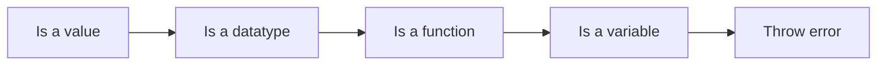

# RlaT Process Processing Structure

##### Line start checking order

1. Check if the line begins with any random value

2. Check if the line begins with a datatype (Functions declarations wil also be checked here, but they are treated differently)

3. Check if the line starts with a function (Build-In first, user second)

4. Check if the line starts with a variable (First local, second global)

5. Throw error if nothing matches



---

##### Line Start Cases

###### Case: Line begins with a number

```cpp
2 + 4 * (3 + 2) - 2;
"Some " + "Text!";
```

If the lines just starts with any number or other Datatype, its assumed that the interpreter is just supposed to calculate the final value of the line, and print it out.

---

###### Case: Line begins with a variable

```cpp
someVar = 33 + 22;
```

This case will happen, when die first expression is unidentified. So the interepter checks, if the a varaible exist with the name. First checking locals, then globals.

After that, the line is just going to be processed.

---

###### Case: Line begins with a Function.

```cpp
print("Some Value");
userFunction("Wee");
```

This case will happen, if the function starts with an Build-In function or an user defined function. Even if the function have a return value, if wont the printed out.

---

###### Case: Line begins with a Datatype

```cpp
int value = 22;
str text = "Wohoo";
func someFunction() {}
```

If the line starts with datatype, its automatically assumed, that a new variable is going to be assigned. If will create a local or global variable, based on if its in a scope of a function.


