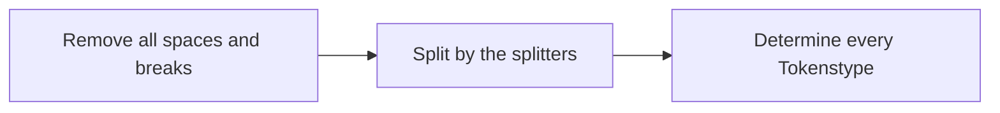

# Tokenizing Algorithm for RlaT

## Algorithm rules

### Splitters

We can immediately split if we get something like that

```cpp
'(){}[];=+-*/.,' 
```

### Processing

The tokenizing have to work without any spaces or breaks.

The entire code will loose all its spaces and breaks, only after that, it will be processed.

The most fundamental rule is, that after every IDENTIFIER or LITERAL a splitters follows. With that rule, we can easily split the lines of code in mutliple small strings. After that process, we can figure out the type of the token, and actually create a Token-Element.



---

## Exampels

```cpp
12 + (23 - 3) * 2;
12+(23-3)*2;

= ["12", "+", "(", "23", "-", "3", ")", "*", "2", ";"]
```

```cpp
print("Hello World!");

= ["print", "(", "\"Hello World!\"", ")", ":"]
```
